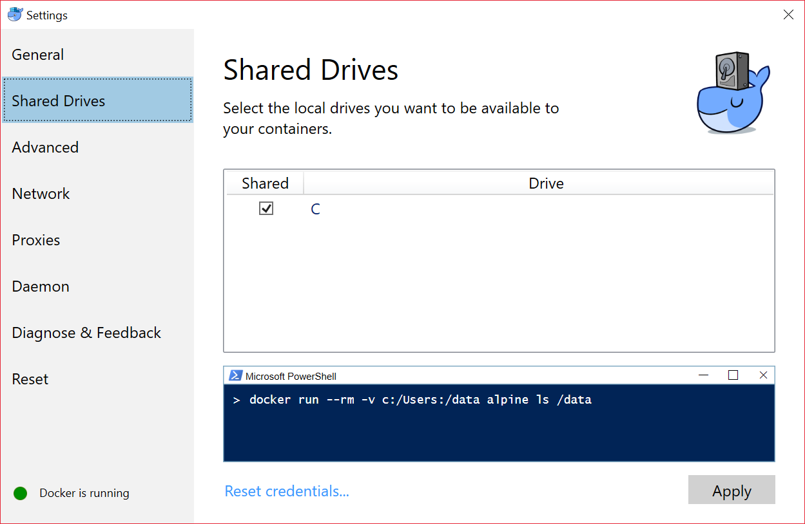
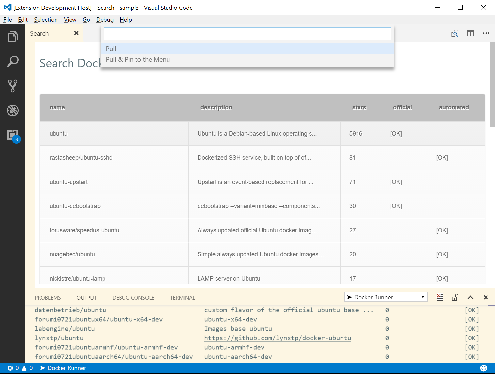
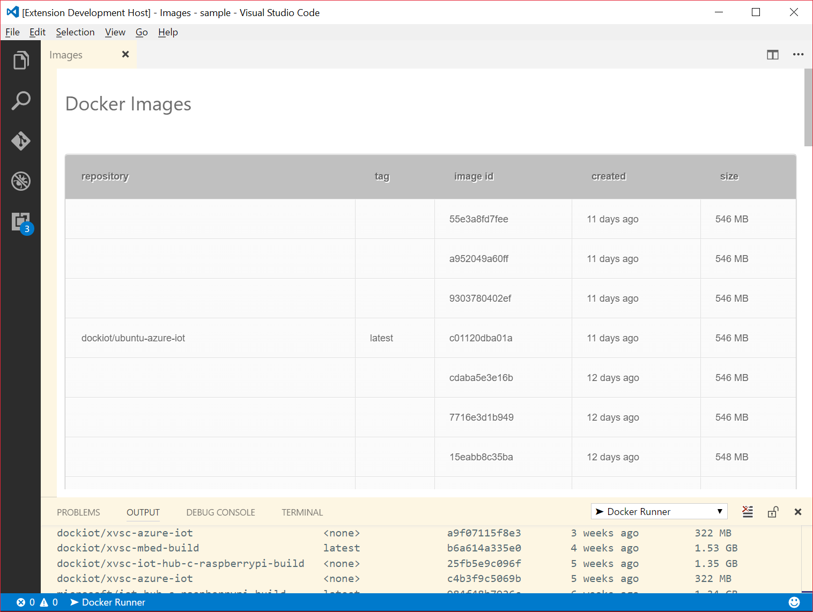
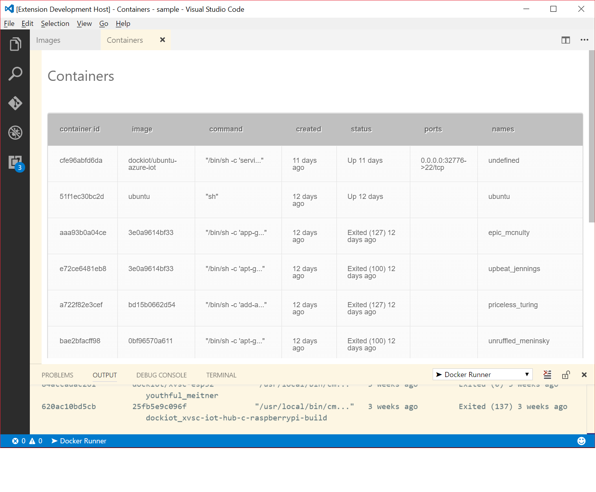

# Docker Runner - Docker Integration for VSC

Docker Runner source available in [GitHub repository here](https://github.com/zikalino/vsc-docker). Any contributions are welcome!

You can find [detailed documentation here](https://github.com/zikalino/vsc-docker/wiki).

Please join [Visual Studio Code LinkedIn Group](https://www.linkedin.com/groups/6974311).

## What this extension can do for you now?

- Search and pull Docker images from Docker Hub
- Easily manage local images
- Manage local containers
- Easily copy files between local filesystem and container file system
- Pin your favourite containers to the main menu
- Run containers conveniently mapped to your local workspace

## How to start?

Press **Alt+Ctrl+D** to activate.

Make sure your local drive is shared, as the extension will attempt to map current directory to the containers.

## Search and pull images from Docker Hub

You can directly search images in Docker Hub by using **Search Images** option from the main menu.

If you choose **Pull & Pin to the menu** option image will appear in the main menu. Default command line parameters are stored in **config.js** file. You can edit this file by selecting **Edit Configuration** option. Edit following line to change any required options:

      "run": "-i -t --rm --name $default-name -v $workspace:$src ubuntu sh"

## Browsing local images

Currently available operations:

- pull
- push
- remove
- history

## Browsing local containers

Currently available operations:

- start / restart / stop / pause
- rename
- remove
- diff
- logs
- browse filesystem

## Browsing container filesystem

Currently available operations:

- copy files between container and local filesystem
- delete files in container and local filesystem
- edit files
- more to come...

Detailed information is [here](https://github.com/zikalino/vsc-docker/wiki/Working-with-Local-Containers).

## Configuration File

Main menu configuration can be changed manually by editing **config.js** file. Choose **Edit Configuration** option from main menu.

More information is available [here](https://github.com/zikalino/vsc-docker/wiki/Extending-Main-Menu).

## Extending

Extension provides an API which can be used by other extensions.

More information is available [here](https://github.com/zikalino/vsc-docker/wiki/Docker-Runner-API).

## Note

Please note this is an early alpha version, so it may have bugs and missing features.
However I think it can be already very useful.
I am still experimenting a lot and I am planning to add much more features in the future. 

