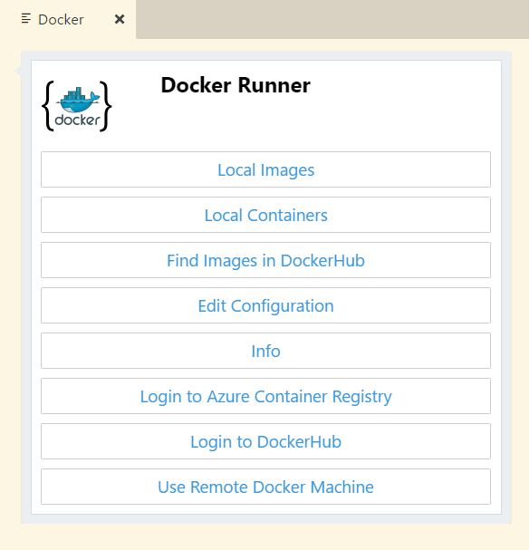

# Docker Runner - Docker Integration for VSC

Docker Runner source available in [GitHub repository here](https://github.com/zikalino/vsc-docker). Any contributions are welcome!

Please join [Visual Studio Code LinkedIn Group](https://www.linkedin.com/groups/6974311).

## How to start?

To Activate extension use:

**ALt+Ctrl+D** to open main menu.

**Alt+Ctrl+I** to display local images

**Alt+Ctrl+C** to display local containers

**Alt+Ctrl+S** to search Docker Hub

# Major Updates

Version **0.30.00**
- Remove running images when image is rebuilt

Version **0.28.00**
- Build image from Dockerfile (if Dockerfile is available in current folder appropriate option will be displayed in local images)
- Rebuild image (Docker Runner remembers Dockerfile location, so any image has additional Rebuild option)

Version **0.27.00**
- kill all containers
- clean "orphanded" images

Version **0.17.0**
 - uses Active Cards as user interface. Explorer view has been depreciated, also custom HTML view was depreciated.

# Notes

Please note this is an early alpha version, so it may have bugs and missing features.
However I think it can be already very useful.
I am still experimenting a lot and I am planning to add much more features in the future. 

Make sure your local drive is shared, as the extension will attempt to map current directory to the containers.

